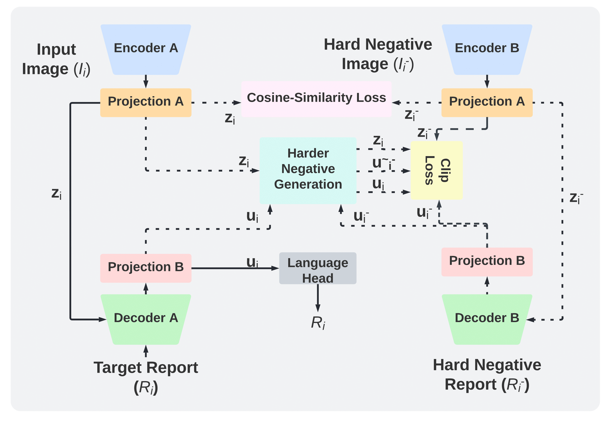

# Automatic Radiology Report Generation by Learning with Increasingly Hard Negatives
This repo is the official implementation of the paper:
Bhanu Prakash Voutharoja, Lei Wang, and Luping Zhou. [Automatic Radiology Report Generation by Learning with Increasingly Hard Negatives](https://arxiv.org/abs/2305.07176). ECAI 2023

## Introduction
<p align="center">
    
</p>

>Automatic radiology report generation is challenging as medical images or reports are usually similar to each other due to the common content of anatomy. This makes a model hard to capture the uniqueness of individual images and is prone to producing undesired generic or mismatched reports. This situation calls for learning more discriminative features that could capture even fine-grained mismatches between images and reports. To achieve this, this paper proposes a novel framework to learn discriminative image and report features  by distinguishing them from their closest peers, i.e., hard negatives. Especially, to attain more discriminative features, we gradually raise the difficulty of such a learning task by creating increasingly hard negative reports for each image in the feature space during training, respectively. By treating the increasingly hard negatives as auxiliary variables, we formulate this process as a min-max alternating optimisation problem. At each iteration, conditioned on a given set of hard negative reports, image and report features are learned as usual by minimising the loss functions related to report generation. After that, a new set of harder negative reports will be created by maximising a loss reflecting image-report alignment. By solving this optimisation, we attain a model that can generate more specific and accurate reports. It is noteworthy that our framework enhances discriminative feature learning without introducing extra network weights. Also, in contrast to the existing way of generating hard negatives, our framework extends beyond the granularity of the dataset by generating harder samples out of the training set. Experimental study on benchmark datasets verifies the efficacy of our framework and shows that it can serve as a plug-in to readily improve existing medical report generation models.

## Installation
Download all the python packages and dependencies by running this cmd:
```
bash setup.sh
```

## Citations

If you use or extend our work, please cite our paper.

```bibtex
@inproceedings{voutharoja2023ITHN,
    title = "Automatic Radiology Report Generation by Learning with Increasingly Hard Negatives",
    author = "Voutharoja, Bhanu Prakash and
      Wang, Lei  and
      Zhou, Luping,
    booktitle="26th European Conference on Artificial Intelligence ECAI 2023",
    year="2023"
}
```

## Requirements

```
conda create -n "ithn" python=3.7
conda activate ithn
pip install -r requirements.txt
```


## Download ITHN Model
You can download the models we trained for each dataset from [here](https://drive.google.com/drive/folders/1cLuEET1QPO3qEDKEbw2nhVZm_arIeRnC?usp=sharing).

## Datasets
We use two datasets (IU X-Ray and MIMIC-CXR) in our paper.

For `IU X-Ray`, you can download the dataset from [here](https://drive.google.com/file/d/1c0BXEuDy8Cmm2jfN0YYGkQxFZd2ZIoLg/view?usp=sharing) and then put the files in `data/iu_xray`.

For `MIMIC-CXR`, you can download the dataset from [here](https://physionet.org/content/mimic-cxr/) and then put the files in `data/mimic_cxr`.

## Run on IU X-Ray

Run `bash run_iu_xray.sh` to train a model on the IU X-Ray data.

## Run on MIMIC-CXR

Run `bash run_mimic_cxr.sh` to train a model on the MIMIC-CXR data.

## Acknowledgment

This GitHub repository is built upon the [R2GenCMN](https://github.com/cuhksz-nlp/R2GenCMN) repository. We would like to thank the authors for sharing their code publicly.
